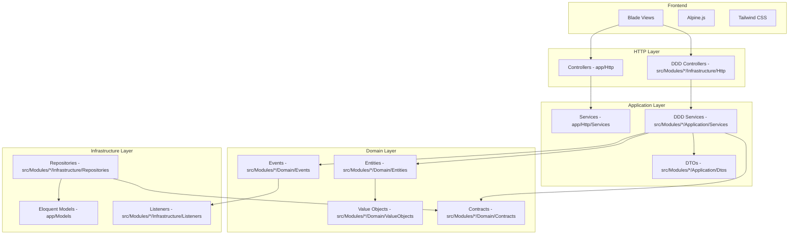

# ResourceFlow — Sistema de Gestión de Recursos

> Sistema institucional para gestión de recursos, personal y vehículos, con control de inventario y asignación por centros de costo.

## Contexto

ResourceFlow es un sistema de gestión de recursos que administra:

- **Centros de Costo** — áreas/departamentos de la organización (por ejemplo: Obras, Logística, Administración)
- **Personal** — empleados asignados a un centro de costo
- **Vehículos** — unidades asignadas a un centro de costo, con chofer
- **Recursos** — combustible y otros insumos (aceites, lubricantes, refrigerantes)
- **Tickets (Vales)** — comprobantes que descuentan litros del inventario de un centro de costo
- **Lotes** — plantillas para generar vales en masa

### Flujo principal

```
1. Un centro de costo compra combustible → se crea un Recurso
2. Personal y vehículos se asignan al centro de costo
3. Se emiten Tickets que descuentan litros del recurso del centro de costo
4. Los tickets se consumen, anulan o vencen → la contabilidad se recalcula
5. Todo queda auditado en el timeline de actividad
```

## Stack

| Capa | Tecnología |
|------|-----------|
| Lenguaje | PHP 8.1+ |
| Framework | Laravel 10 |
| Auth | Fortify + Sanctum + Spatie Permission |
| Frontend | Blade + Alpine.js + Tailwind CSS + Vite |
| Database | MySQL 8 |
| PDF/Excel | DOMPDF, Laravel Excel |

## Arquitectura

El proyecto usa **Clean Architecture híbrida**: CRUD simples en el MVC clásico de Laravel, lógica de negocio compleja en un kernel modular con DDD.



### Módulos DDD

```
src/Modules/
├── ActivityLog/    → Auditoría y timeline de actividad
├── Bolsa/          → Contabilidad de litros por recurso
├── Lote/           → Generación masiva de tickets
├── Recurso/        → Gestión de inventario de combustible
├── Tickets/        → Emisión, edición, anulación de vales
└── ServicesProviders/ → EventServiceProvider
```

### Decisiones de diseño

**¿Por qué DDD solo para módulos complejos?**

El CRUD de Personal, Vehículos y Centro de Costo se mantiene en el MVC clásico de Laravel porque la lógica es straightforward. Los módulos de Tickets, Recurso y Lote migraron a Clean Architecture/DDD porque tienen:

- Contabilidad estricta de litros (un recurso no puede quedar negativo)
- Lock pesimista en ediciones para evitar race conditions
- Eventos de dominio para desacoplar auditoría y rebalanceo
- Repository patterns con contratos

**¿Por qué eventos de dominio?**

Cada acción importante (TicketWasCreated, TicketWasUpdated, TicketWasDeleted, LoteWasGenerated) dispara un evento que registra la actividad automáticamente. Esto permite agregar comportamiento sin modificar el servicio original (Open/Closed Principle).

**¿Por qué rebalanceo automático?**

Cuando un ticket se emite, consume litros de un recurso. Cuando se anula, devuelve litros. El `RebalanceRecursosService` redistribuye automáticamente los litros entre los recursos disponibles de una estación y combustible, evitando que un recurso se quede vacío mientras otro tiene stock.

## Decisiones de Arquitectura (ADR)

### ADR-001: Centro de Costo como entidad raíz

**Contexto:** El sistema maneja una organización donde cada área tiene su propio presupuesto de combustible.

**Decisión:** `centro_costo_id` aparece en Personal, Vehículos, Recursos y Tickets.

**Trade-off:** Un empleado de un centro de costo puede usar un vehículo asignado a otro centro de costo, y el vale se descuenta del centro del vehículo. Esto es intencional porque los vehículos se mueven entre áreas.

**Estado:** Pendiente de validación con el stakeholder sobre si se debe reforzar coherencia entre vehículo y personal.

### ADR-002: Contabilidad con lock pesimista

**Contexto:** Múltiples usuarios pueden emitir tickets simultáneamente para el mismo recurso, riesgo de litros negativos.

**Decisión:** Usar `SELECT ... FOR UPDATE` (lock pesimista) al emitir o editar tickets, dentro de un `DB::transaction`.

**Alternativa descartada:** Lock optimista (reintentar en conflicto) — demasiado complejo para el caso de uso de una organización con pocos usuarios concurrentes.

### ADR-003: Eventos de dominio para auditoría

**Contexto:** Cada acción (crear, editar, anular, consumir, vencer un ticket) debe quedar registrada con quién, cuándo y qué cambió.

**Decisión:** Un solo listener `RecordActivityListener` maneja todos los eventos y guarda en `activity_logs`. Los controllers no manipulan logs directamente.

**Beneficio:** Separación de responsabilidades — el servicio no sabe que hay auditoría, el listener no sabe cómo se creó el ticket.

## Quick Start

### Con Docker (recomendado)

```bash
cp .env.example .env
docker compose up -d
php artisan key:generate
php artisan migrate
php artisan db:seed
npm install && npm run dev
```

### Sin Docker

```bash
composer install
cp .env.example .env
php artisan key:generate
php artisan migrate
php artisan db:seed
npm install && npm run dev
php artisan serve
```

### Credenciales por defecto

| Usuario | Contraseña | Rol |
|---------|-----------|-----|
| admin@admin.com | secret | Administrador |

## Tests

```bash
# Ejecutar todos los tests
php artisan test

# Ejecutar tests con coverage
php artisan test --coverage

# Ejecutar un archivo específico
php artisan test tests/Feature/TicketFeatureTest.php
```

### Cobertura de tests

| Capa | Tests | Qué cubren |
|------|-------|-----------|
| Tickets | Feature tests | Emisión, edición, anulación, vencimiento, contabilidad |
| Recursos | Feature tests | Creación, rebalanceo, litros disponibles |
| Lotes | Feature tests | Generación masiva, empleados manuales |
| Reportes | Feature tests | Exportación CSV de emitidos/consumidos |
| Bolsa | Unit tests | Descuento de litros, validación negativa |
| Migraciones | Feature tests | Integridad de esquema y FK |

## Estructura del proyecto

```
├── app/                        → Laravel clásico
│   ├── Console/Commands        → Comandos artisan
│   ├── Exports                 → Exportaciones Excel/CSV
│   ├── Http/Controllers        → CRUD simples (Personal, Vehículos, Centro Costo)
│   ├── Http/Requests           → Validación de formularios
│   ├── Listeners               → Listeners de eventos legacy
│   ├── Models                  → Modelos Eloquent
│   └── Presenters              → Formateo de datos (ActivityLog)
├── database/
│   ├── factories               → Factories para tests
│   ├── migrations              → Migraciones de la DB
│   └── seeders                 → Datos iniciales (roles, permisos, personal)
├── resources/views/            → Blade templates
├── routes/                     → Rutas web
├── src/                        → Kernel modular (DDD)
│   ├── Modules/
│   │   ├── ActivityLog/        → Auditoría y timeline
│   │   ├── Bolsa/              → Contabilidad de litros
│   │   ├── Lote/               → Generación masiva de tickets
│   │   ├── Recurso/            → Inventario de combustible
│   │   ├── Tickets/            → Emisión y gestión de vales
│   │   └── ServicesProviders/  → EventServiceProvider
│   └── Shared/                 → Contratos compartidos
└── tests/
    ├── Feature/                → Tests de integración
    ├── Unit/                   → Tests unitarios
    └── Browser/                → Tests Dusk (E2E)
```

## Stack de desarrollo

- **PHP 8.1+** / **Laravel 10**
- **MySQL 8** (producción) / **SQLite** (tests Dusk)
- **PHPUnit 10** + **Laravel Dusk**
- **Blade** + **Alpine.js** + **Tailwind CSS** + **Vite**
- **Spatie Permission** para roles y permisos
- **DOMPDF** para generación de PDFs
- **Laravel Excel** para exportaciones

## Limitaciones Conocidas

- **`migrate:rollback` no es soportado** — Hay 10 migraciones de consolidación sin operaciones reversibles. El esquema queda consolidado en los `CREATE` originales. Usar `migrate:fresh` o `db:wipe && migrate` para reinstalaciones y rollbacks limpios.
- **Tests corren contra un schema dedicado `fuelpass_test`** — Local: MySQL 127.0.0.1:3307. CI: MySQL 3306. Verificar que el schema de pruebas exista antes de correr tests (`php artisan test`).
- Solo las migraciones añadidas en este cambio son reversibles (columnas dropeables y unique constraint).

## Licencia

Proyecto de gestión de recursos — demo/portfolio.
