# Exploratory Test — Lotes Flow (FuelPass / ResourceFlow)

- **Date:** 2026-08-27
- **Target:** http://127.0.0.1:8000
- **Scope:** Lotes module — list, create, verify, edit, PDF download, print, delete, generate (happy + error path)
- **Method:** Playwright (chrome stable, headless)
- **Credentials:** `admin@admin.com` / `secret` (full admin, all 35 permissions)

## 1. Executive summary

All 9 executed checks **passed with OK**. The full LOTES lifecycle works end to end: login → list → create (with manual employee) → verify → edit (name + liters persistence) → PDF download (`200 application/pdf`, `.pdf` filename) → print view (`200`, renders lote data in a new tab) → delete (success flash, row gone) → **Generar** in both its happy path (lote 4, bolsa present → creates tickets) and its **error path** (lote 2, no bolsa → clean redirect with friendly error flash **instead of the previous HTTP 500**).

- **HTTP errors captured:** none (`0` responses ≥ 400 across the whole run).
- **JS console errors:** none.
- **Page errors (uncaught exceptions):** none.
- **Headline regression verified:** the previously reported bug **H-01** (lote `Generar` returning HTTP 500 on `CombustibleNotFoundInEstacion`) is **now fixed** — `GenerateLoteController` catches the domain exception and redirects with a `error` flash (lote 2: `El combustible no está disponible en el centro de costo del lote…`), while the happy path still works when a bolsa exists.

## 2. Approved context and scope

User-approved run (exhaustive script provided by the user). Constraint honored: **no modification of application source code**; runtime evidence only under `docs/testing/`. A single orphan row created by a crashed first attempt (lote 5) was deleted as housekeeping.

## 3. Environment and assumptions

| Item | Value |
|---|---|
| App | Laravel (FuelPass / ResourceFlow), local via `127.0.0.1:8000` |
| Preflight | `GET /` → 200, `GET /login` → 200 |
| Browser | Google Chrome stable (system), headless, viewport 1440×900 |
| Runner | `playwright-core` installed in `/tmp/fuelpass-tests` (outside repo) |
| DB state | Users 1, Centros multiple, Combustibles 28, Lotes kept as test data, Bolsas present; lote 2 (`cc=1, tc=23`) has **no** bolsa; lote 4 (`Zona Sur + super_max`) has bolsas |
| Report root | `docs/testing` (screenshots under `docs/testing/screenshots3/lotes-flow/`) |

## 4. Executed flows

1. Login → `/lotes` list; visitor row exists (`Lote Explo2 Run Edit 4`: Zona Sur, Administrador, super_max, 2 empleados, Activo) with Editar / Generar / Descargar PDF / Imprimir / Eliminar.
2. Create lote with manual employee (litros + cantidad de vales).
3. Verify new lote in list with correct data.
4. Edit new lote (change nombre + update litros).
5. Download PDF (`lotes.pdf`) — capture response 200 + content-type + download filename.
6. Print (`lotes.imprimir`, `target=_blank`) — capture popup response 200 + rendered lote data.
7. Delete new lote — success flash + row gone.
8. Generar happy path — `Lote Explo2 Run Edit 4` (Zona Sur / super_max, bolsa exists).
8b. Generar error path — `Lote Explo2 Run Edit` (lote 2, no bolsa) — verifies the H-01 fix.

## 5. Flow-by-flow result

| # | Flow | Result | Notes |
|---|------|--------|-------|
| 1 | Login + list | **OK** | Baseline row present with all 5 actions |
| 2 | Create lote | **OK** | Flash `Lote creado exitosamente.` |
| 3 | Verify list | **OK** | Row: `Lote Test Playwright …`, Explo2 Centro 2763, Administrador, Aceite 10W30 (aceites), 1, Activo |
| 4 | Edit lote | **OK** | Nombre updated, `litros` persisted `150` |
| 5 | Descargar PDF | **OK** | HTTP 200, `application/pdf`, filename `…pdf (*.pdf=true)` |
| 6 | Imprimir | **OK** | Popup 200, `LOTE DE COMBUSTIBLE` + `header-info` shows lote nombre |
| 7 | Eliminar | **OK** | Flash `Lote eliminado exitosamente.`, row gone |
| 8 | Generar happy path | **OK** | 302 → `Lote generado exitosamente. Se crearon 1 tickets.` |
| 8b | Generar error path | **OK** | 302 → friendly `combustible no disponible` flash — **no 500** |

## 6. Key evidence (network / console)

- **HTTP ≥ 400:** none.
- **Console errors:** none.
- **Page exceptions:** none.
- PDF endpoint: `GET /lotes/{id}/pdf` → **200**, `content-type: application/pdf`, Content-Disposition download `lote-<name>.pdf`.
- Print endpoint: `GET /lotes/{id}/imprimir` → **200** in new tab/page.
- Generar (lote 2): `POST /lotes/2/generar` → **302** (was **500** in the previous run / H-01).
- Generar (lote 4): `POST /lotes/4/generar` → **302** → new Ticket created (combustible `super_max`).

## 7. Flow evidence gallery

### 1. Login + list
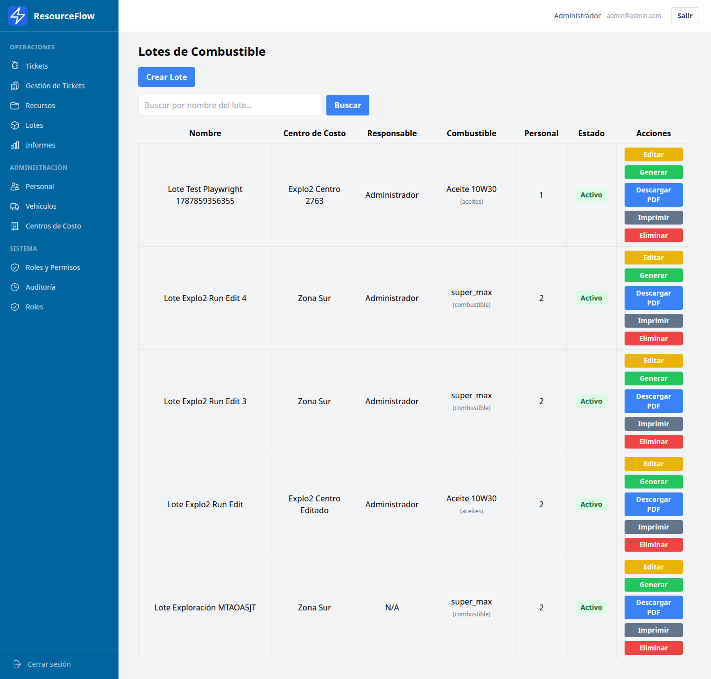

### 2. Create
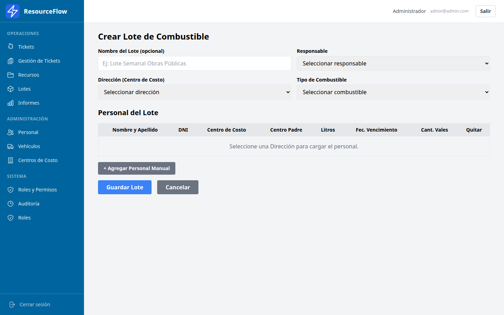

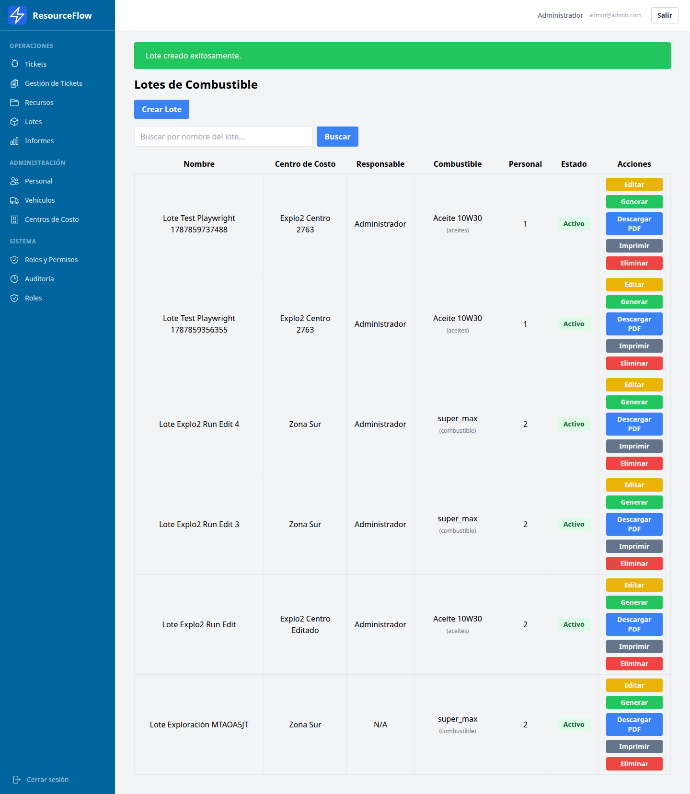

### 3. Verify

### 4. Edit
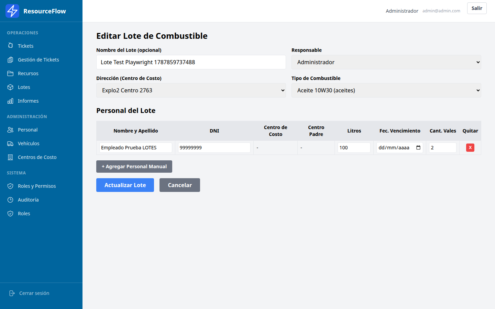
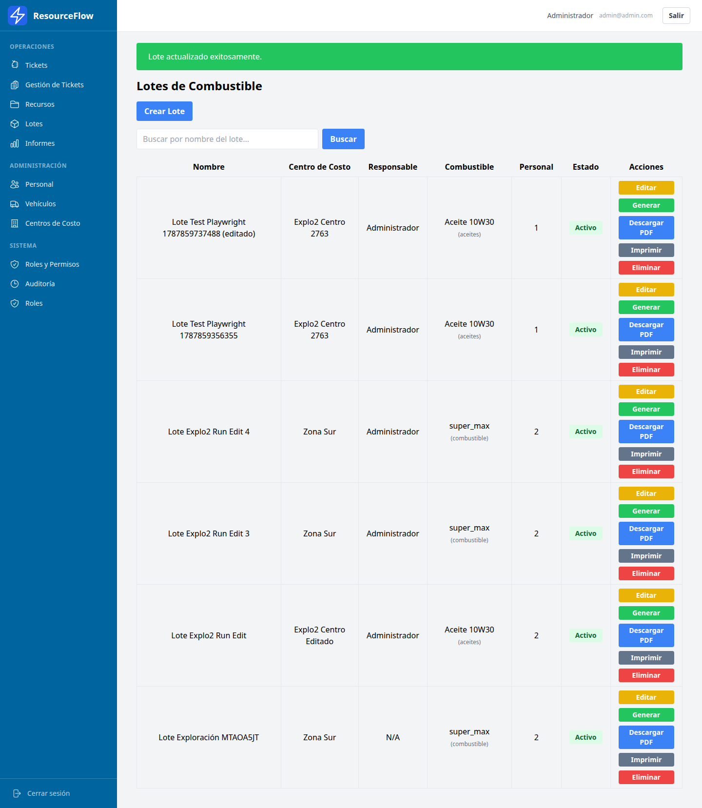

### 5. PDF download
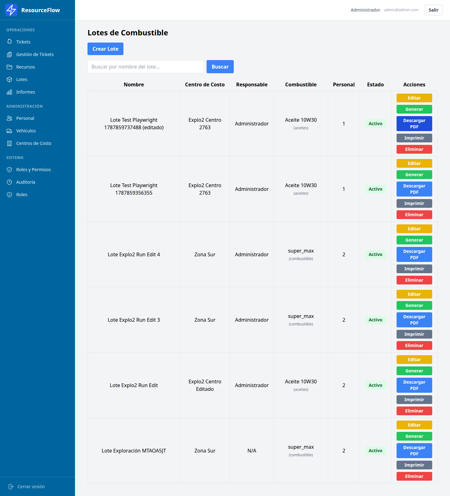

### 6. Print view
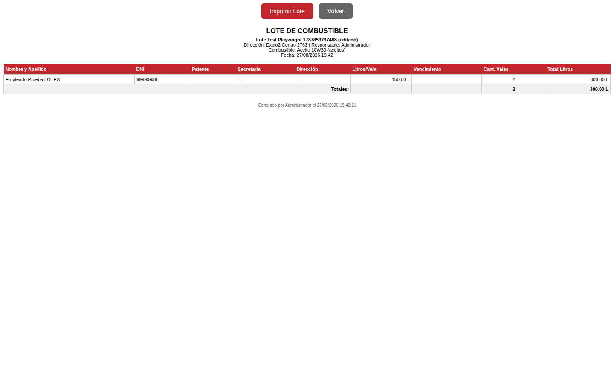
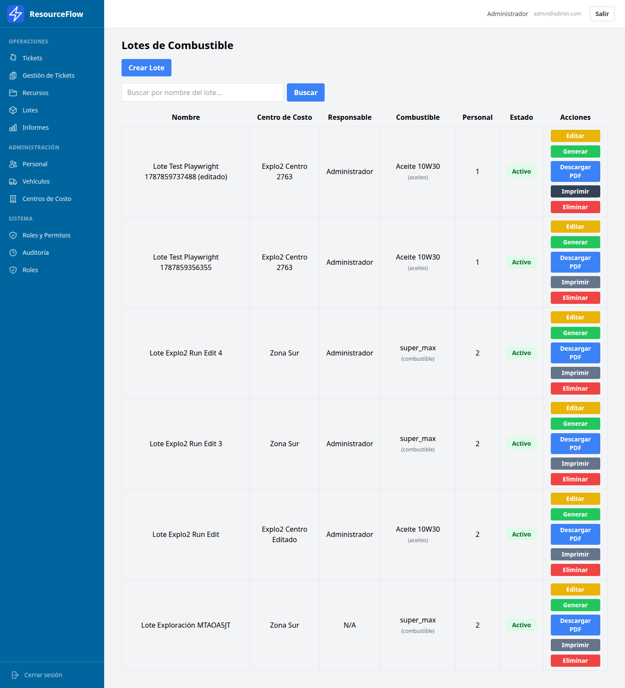

### 7. Delete
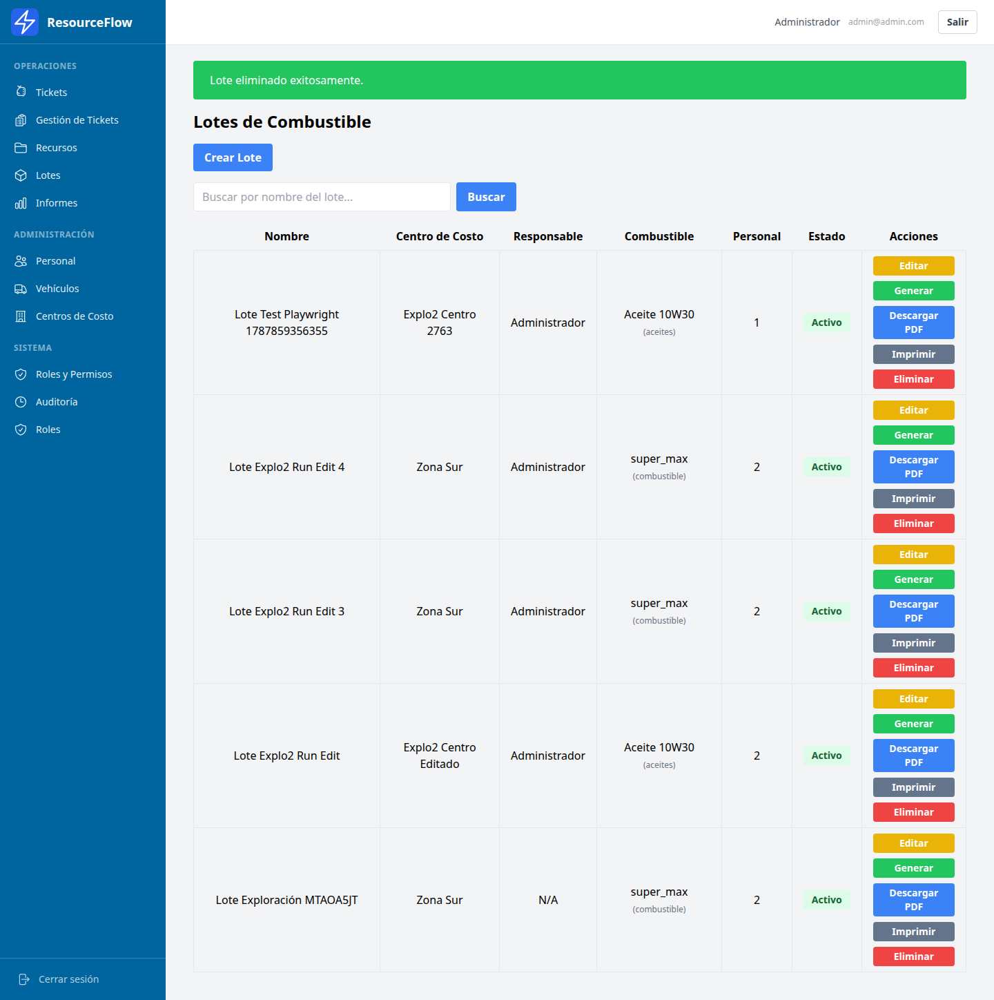

### 8. Generar
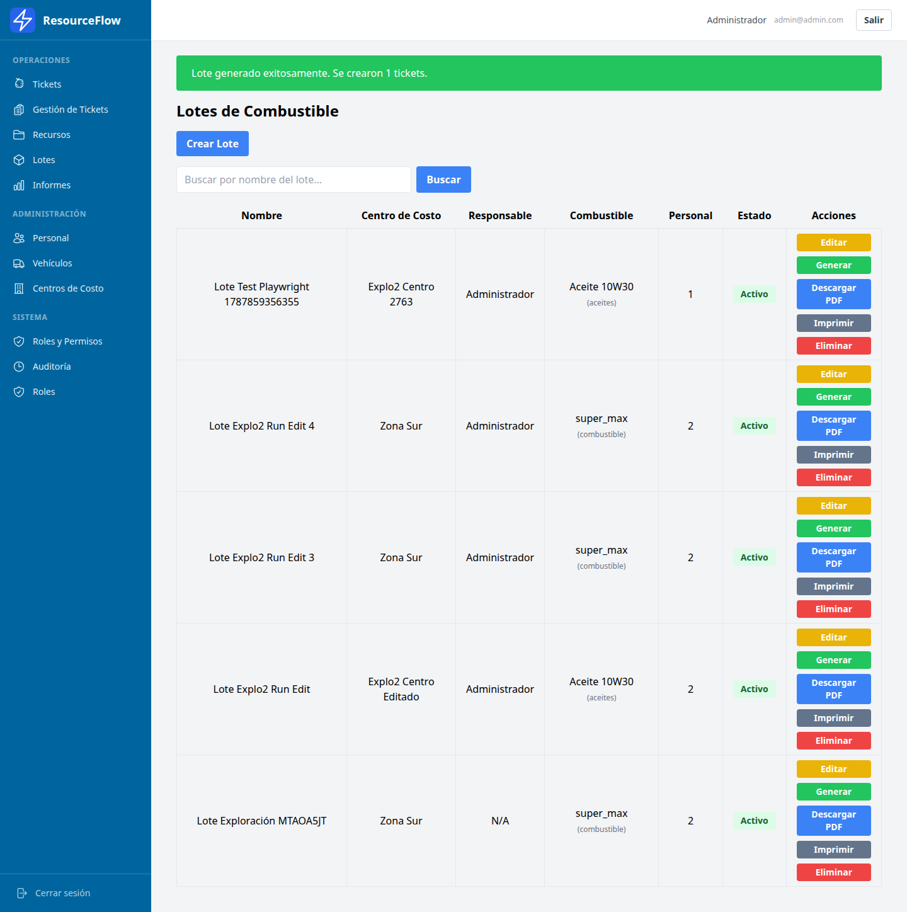
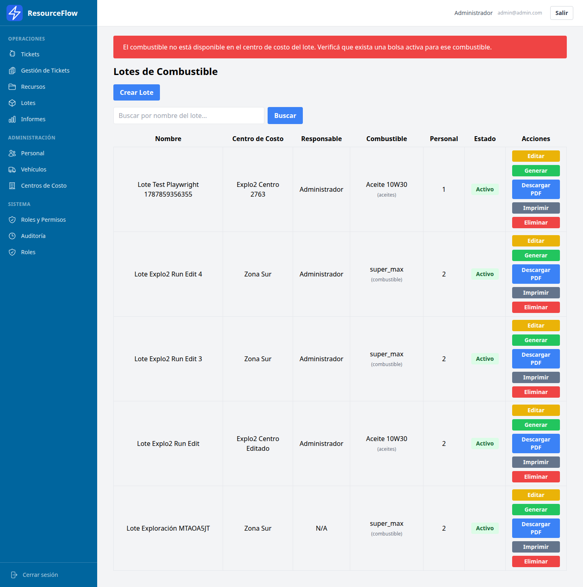

## 8. Prioritized findings

### High
None. No blocking defects found in the LOTES flows.

### Medium
- **(M-01 — fixed/verified)** `POST /lotes/2/generar` previously returned HTTP 500 (H-01, unhandled `CombustibleNotFoundInEstacion`). **Now returns 302 + error flash.** The fix introduced in `GenerateLoteController` is confirmed working. Keep covered by a regression check in CI.

### Low
- **(L-01)** An inactive bolsa (`activa=0`) for `super_max`/Zona Sur still allowed ticket generation on lote 4. The generator matches combustible by centro only; the `activa` flag is not enforced in the happy path. If "active bolsa only" is the business rule, this is a mismatch worth confirming.
- **(L-02)** DOM remark: in the list, both the success/error flash `
`s and the action buttons share utility classes (`bg-green-500` / `bg-red-500`). Evidence collectors should target the flash via `div.bg-*-500.px-6.py-4` (text `px-6`/`py-4` is flash-only).

## 9. Non-invasive recommendations

- Add stable `data-testid` attributes to the flash containers (e.g. `flash-success`, `flash-error`) and to the per-row action buttons (`btn-editar`, `btn-generar`, `btn-pdf`, `btn-imprimir`, `btn-eliminar`) — improves automability and removes the class-collision ambiguity (L-02).
- For the `Generar` buttons, confirm/formalize whether generation must require an **active** bolsa (`activa=1`); if so, align the domain check with the error flash (L-01).
- Keep a single end-to-end smoke that exercises both Generar branches (bolsa present → tickets; bolsa absent → error flash, never 5xx) to guard the H-01 regression.

## 10. Residual risks and next steps

- **Residual:** The H-01 regression is verified against the local environment and DB state present today; a fresh DB with empty bolsas would exercise the error path with other centro/combustible pairings.
- Tests were run with `admin` (full permissions); per-permission flows (e.g. `puede_borrar_lote` withheld) were not exercised.
- The `Imprimir` flow was validated at the HTML level (new-tab render); actual printer output was not verified.
- **Next step (optional):** convert these flows into a repeatable e2e suite and add the Generar negative case as a permanent test.